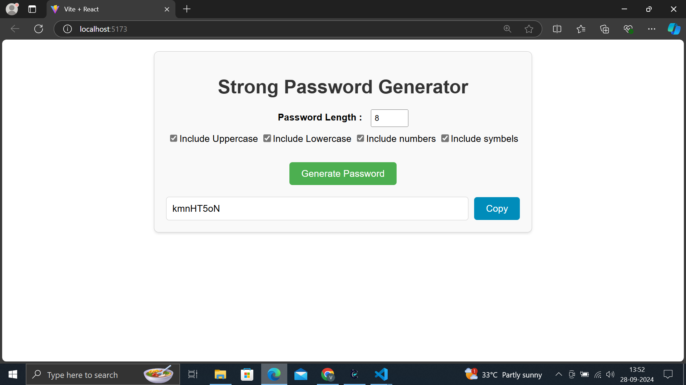

# 🛡️ Strong Password Generator
🎨 Screenshots


## 📋 Overview

The **Strong Password Generator** is a user-friendly application that allows users to create secure passwords based on specified criteria. Users can define the desired password length and select options for including uppercase letters, lowercase letters, numbers, and special symbols. 

## 🚀 Features

- **Customizable Password Length**: Users can specify the length of the password.
- **Character Options**:
  - ✅ Include Uppercase Letters
  - ✅ Include Lowercase Letters
  - ✅ Include Numbers
  - ✅ Include Symbols
- **Instant Password Generation**: Based on the selected options, a strong password is generated in real-time.
  
## 📦 Technologies Used

- **Frontend**: React, CSS, HTML
- **Icons**: Font Awesome or any other icon library (if used)

## 🔧 Installation

1. Clone the repository:
   ```bash
   git clone https://github.com/RVJVIJAY/strongpasswordgenerator.git 

2.**Navigate to the project directory:**

     cd password
3.**Install dependencies using npm or yarn:**

    npm install
4.**Start the development server:**

    npm run dev
5.**Open the app in your browser:**

    Once the development server is running, open http://localhost:5173 to view the application in your browser.


📊 How It Works
* Input Field: Users can specify the length of the password they want to generate.
* Checkbox Options: Users can select the character types they want to include in the password.
* Generate Password Button: After setting the criteria, users click the button to generate a strong password based on their selections.
* Password Display: The generated password will be displayed for users to copy.

📄 Usage
* Enter the desired password length in the input field.
* Select the desired character options using the checkboxes.
* Click the Generate button to create a strong password.
* Copy the generated password for use.

📞 Contact
For any inquiries or feedback, feel free to reach out:

GitHub: RVJVIJAY
